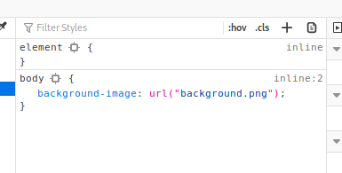

# A little something to get you started - FLAG0


## Step 1 : Inspect Element

If you check inspect element under body


## Step 2 : CSS

There is an background image under css but not show on the page.



```css
body {
	background-image: url("background.png");
}
```

## Step 3 : Check Image

http://xxx/xxx/background.png


