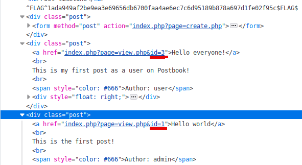
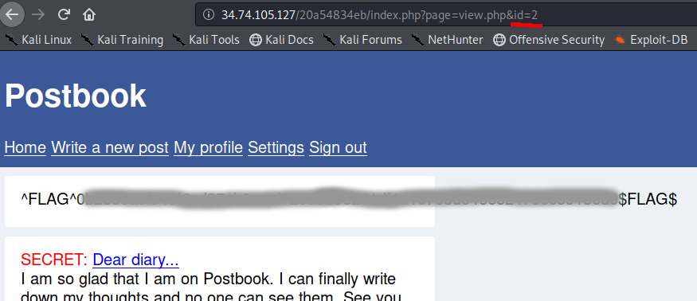

# Postbook - FLAG1

## Step 1 : Inspect

Two post both with id 1 and 3.

## Step 2 : Flag

What about id 2?

http://xxx/xxx/index.php?page=view.php&id=2

ID 2 suppose to be a secret post but sometimes websites doesn't care much about not giving these kind of post public access.
