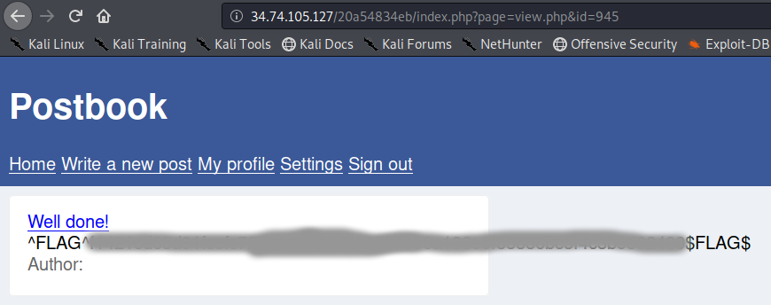

# Postbook - FLAG3

## Step 1 : View Post

http://xxx/xxx/index.php?page=view.php&id=1

## Step 2 : FLAG

The id seems can be change (189 * 5 = 945).

http://xxx/xxx/index.php?page=view.php&id=945

Tip: Many a time it happens that admins of the website have a very large number as an ID which can use to communicate with each other, always good to brute force the IDs and check the connection reponse.
