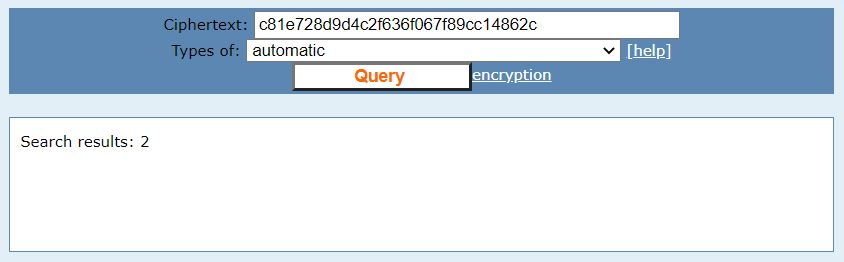
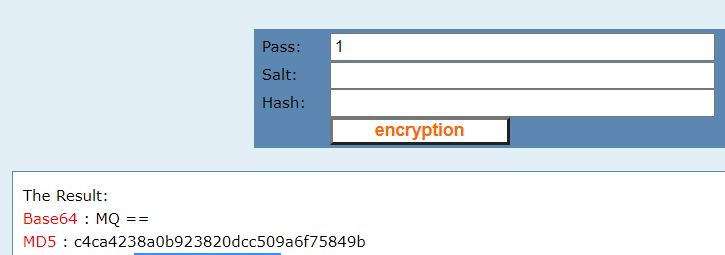
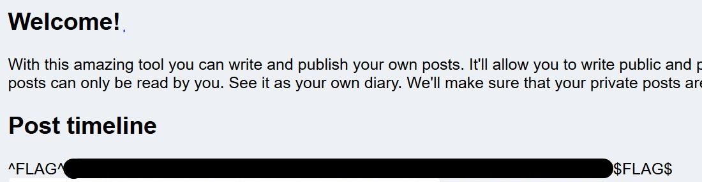

# Postbook - FLAG5

## Step 1 : Get Cookie

Use **Cookie Editor** plugin to get the cookie.
Derypt using [CMD5](https://www.cmd5.com/)

```
id: c81e728d9d4c2f636f067f89cc14862c
```



## Step 2 : Get Admin Cookie

Encrypt **1**
```
result: c4ca4238a0b923820dcc509a6f75849b
```


## Step 3 : FLAG

Delete other cookie and add, 
```
id: c4ca4238a0b923820dcc509a6f75849b
```
as cookie and reload the page.


