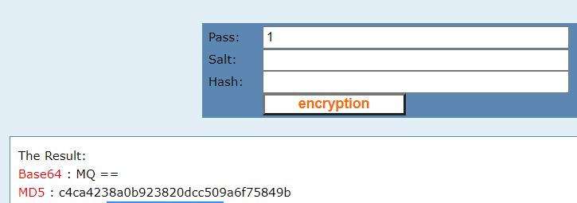

# Postbook - FLAG5

## Step 1 : Inspect Element (delete link)

Looks like a MD5 value to delete post.

Derypt using [CMD5](https://www.cmd5.com/)

```
id: c81e728d9d4c2f636f067f89cc14862c
```


## Step 2 : Decrypt 

You will get 2, how about encrypt **1**
```
result: c4ca4238a0b923820dcc509a6f75849b
```


## Step 3 : FLAG

Change id to the new one, 

http://xxx/xxx/index.php?page=delete.php&id=c4ca4238a0b923820dcc509a6f75849b


